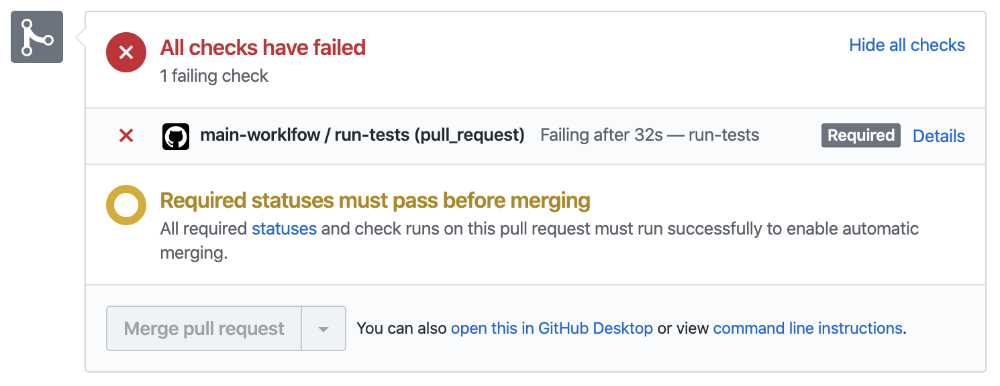

# Github Actions tutorial

This tutorial will guide you through building a functional CI/CD pipeline with
Github Actions. You will create a workflow that automatically runs unit tests on
all pull requests, and deploys the latest version of the master branch to a
Kubernetes cluster.

For an introduction to the core concepts behind GitHub Actions, I recommend
reading [this article](https://www.padok.fr/en/blog/github-actions) to learn
the basic vocabulary used in this tutorial.

## Requirements

To complete this tutorial, you will need the following:

- A Github account. No paid plan is necessary.
- Basic knowledge of git and Github: how to commit changes to branches and open
  pull requests.
- A [DockerHub](https://hub.docker.com/) account. Alternatively, you can use any
  public container registry for this tutorial.
- A working Kubernetes cluster. You must have the [`kubectl`](https://kubernetes.io/docs/tasks/tools/install-kubectl/)
  command-line tool configured with administrator-level previleges on your
  cluster. For example, a fresh [Google Kubernetes Engine](https://cloud.google.com/kubernetes-engine)
  cluster will work perfectly. This tutorial will work on most cloud-providers.

## Step 0: Fork this repository

The first thing you should do is [fork](https://help.github.com/en/github/getting-started-with-github/fork-a-repo)
this repository. As you advance through the steps below, you can add your work
to your fork.

Once forked, clone the repository:

```bash
git clone https://github.com/YOUR_USERNAME/github-actions-tutorial.git
cd github-actions-tutorial
```

## Step 1: Explore the repository

This repository contains code for a simple HTTP server. Here is a quick tour of
the files already in place. Feel free to take a deeper look at the code if you
are interested.

The `go.mod`, `main.go` files and `foobar/` directory implement a rudimentary
HTTP server, complete with unit tests. The server has two endpoints: `/foobar`,
which responds with a FooBar sequence, and `/healthz`, which reports on the
server's health.

A `Dockerfile` provides a recipe for compiling the Go code into a [container image](http://www.padok.fr/en/blog/container-docker-oci).

The `manifests/` directory contains Kubernetes resource specifications and a
[Kustomize](https://kustomize.io/) configuration file.

## Step 2: Automatically run unit tests

The `foobar` package contains unit tests. A good practice is to run unit tests
on all pull requests and on every commit to the master branch.

Create a `.github/workflows/workflow.yml` file in your repository for your
GitHub Actions **workflow**. In the file, start with a name:

```yaml
name: main-worklfow
```

Use the `on` field to trigger your workflow whenever a commit is pushed to the
master branch or a pull request is made:

```yaml
on:
  push:
    branches:
      - master
  pull_request:
    branches:
      - master
```

A workflow is composed of independent **jobs**. Create a job called `run-tests`
that will run the application's unit tests:

```yaml
jobs:
  # Run all unit tests.
  run-tests:
```

Every job requires an operating system to run on. For this tutorial, you will be
using Ubuntu. Fill in the `runs-on` field of the job:

```yaml
jobs:
  # Run all unit tests.
  run-tests:
    runs-on: ubuntu-latest
```

Jobs contain a list of **steps**, which are executed consecutively. Often, the
first step is to clone your repository to use the source code it contains. To do
this, use an **action** provided by Github, called `actions/checkout`. To use
this action, fill in the `uses` field of the first step:

```yaml
jobs:
  # Run all unit tests.
  run-tests:
    runs-on: ubuntu-latest
    steps:
      # Check out the pull request's source code.
      - name: Check out source code
        uses: actions/checkout@v2
```

Next, you need to have Go installed to run your unit tests. There is already an
action that sets up everything for you, called `actions/setup-go`. This action
takes a `go-version` parameter, to know which version of Go to install.
Provide parameters to an action by filling in the `with` field:

```yaml
steps:
  # Check out the pull request's source code.
  - name: Check out source code
    uses: actions/checkout@v2

  # Install Go.
  - name: Set up Go
    uses: actions/setup-go@v2-beta
    with:
      go-version: "^1.14" # The Go version to download and use.
```

In the code above, `^1.14` means `1.14.x`, where `x` can be anything. Each
`1.14.x` release of Go is compatible with your code, so this is not an issue.
That being said, it would be nice to know exactly which version of Go
you are using here. Print the version in the next step. There is no existing
action that does this, so use the `run` field to execute the `go version`
command:

```yaml
# Install Go.
- name: Set up Go
  uses: actions/setup-go@v2-beta
  with:
    go-version: "^1.14" # The Go version to download and use.
- name: Print Go version
  run: go version
```

The `run` field allows you to run any shell command. Use it again in the job's
final step to run your application's unit tests:

```yaml
# Run unit tests.
- name: Run unit tests
  run: go test -v ./...
```

At this point, you should have the following code for your workflow:

```yaml
name: main-worklfow

env: {}

on:
  push:
    branches:
      - master
  pull_request:
    branches:
      - master

jobs:
  # Run all unit tests.
  run-tests:
    runs-on: ubuntu-latest
    steps:
      # Check out the pull request's source code.
      - name: Check out source code
        uses: actions/checkout@v2

      # Install Go.
      - name: Set up Go
        uses: actions/setup-go@v2-beta
        with:
          go-version: "^1.14" # The Go version to download and use.
      - name: Print Go version
        run: go version

      # Run unit tests.
      - name: Run unit tests
        run: go test -v ./...
```

Commit these changes and push them to the master branch:

```bash
git checkout master
git pull
git add .github/workflows/workflow.yml
git commit -m 'Add run-tests job to workflow'
git push
```

## Step 3: Check workflow results

When you pushed your commit to Github, it automatically triggered the workflow.
On your repository's page, go to the **Actions** tab. You should see the run in
question.

If it is still running, it will have a yellow dot next to your commit message.
Once it has finished, depending on the result it will have either a red cross
or a green tick. For this first run, the unit tests should pass and the workflow
should complete successfully.

## Step 4: Create a pull request

Your workflow not only triggers when commits are pushed to master, but also when
developers make pull requests. Check out a new branch called `awesome-feature`:

```bash
git checkout -b awesome-feature
```

Edit the `foobar/foobar.go` file to introduce a breaking change. For instance,
replace a `5` with a `7`. Then, commit and push the change to Github:

```bash
git add foobar/foobar.go
git commit -m 'Introduce breaking change'
git push -u origin awesome-feature
```

Go to your repository's webpage and [create a pull request](https://help.github.com/en/github/collaborating-with-issues-and-pull-requests/creating-a-pull-request)
for the new branch. Make sure to merge into the master branch of your
repository, and not into `padok-team`'s. Once the pull request is created, the
workflow will trigger and Github will display its progress on the pull request's
page:



Since you introduced a breaking change, the unit tests are failing and your
workflow as well. Github displays this prominently, so developers are aware of
the issue as soon as possible.

Fix the issue in `foobar/foobar.go`, then commit and push the fix:

```bash
git add foobar/foobar.go
git commit -m 'Fix breaking change'
git push
```

Once the push is through, Github will trigger the workflow again. This time, it
will pass.


You can merge your pull request into the master branch, confident that your
awesome feature does not introduce a breaking change.

## Step 5: Automatically build and release a container image

Now that your application is fully tested, time to package it as a container
image, and then push that image to a container registry like DockerHub.

> You need a DockerHub account for this step. The image repository will
> automatically be created when your workflow pushes the first image. The
> repository should be public, otherwise Kubernetes will not be able to pull any
> images to deploy without credentials.

Go back to the master branch to keep working on your workflow:

```bash
git checkout master
git pull
```

Add a second job to the workflow, called `build-and-release`. This job also runs
on Ubuntu and starts by checking out your source code:

```yaml
# Build and release.
build-and-release:
  runs-on: ubuntu-latest
  steps:
    # Check out source code.
    - name: Check out source code
      uses: actions/checkout@v2
```

[Docker Inc.](https://www.docker.com/company) has published an action that
builds container images and pushes them to a container registry. This is exactly
what you aim to do, so use `docker/build-push-action` in your job's next step.

This action requires you specify the repository to push your image to. This is a
great usecase for environment variables. At the top of your workflow file, fill
in the `env` field to add an `IMAGE_REPOSITORY` variable equal to the image
repository you wish to store your image in. For example, my DockerHub handle is
`busser` so I wrote:

```yaml
env:
  IMAGE_REPOSITORY: busser/foobar
```

In order to push images to an image registry, Github Actions requires
credentials to authenticate itself. Sensitive information like usernames and
passwords should _never_ be written inside files commited to a version control
system like git. Thankfully, Github provides a way to manage secret values.

On your repository's webpage, go the **Settings** tab, then select **Secrets**
in the left-hand menu. There, add two secrets: `DOCKER_USERNAME` and
`DOCKER_PASSWORD`, containing your DockerHub credentials.

You are now ready to add the final step to your job, using a community-built
action, and without compromising on security. You shouldn't simply use the
`latest` tag for your container image, so tell the `docker/build-push-action`
action to tag your image with the name of the branch and the hash of the commit
that triggered the workflow.

```yaml
# Build and release.
build-and-release:
  runs-on: ubuntu-latest
  steps:
    # Check out source code.
    - name: Check out source code
      uses: actions/checkout@v2

    # Build and push container image.
    - name: Build and push container image
      uses: docker/build-push-action@v1
      with:
        username: ${{ secrets.DOCKER_USERNAME }}
        password: ${{ secrets.DOCKER_PASSWORD }}
        repository: ${{ env.IMAGE_REPOSITORY }}
        tag_with_ref: true
        tag_with_sha: true # sha-${GITHUB_SHA::7}
```

Whenever you use `${{ ... }}` inside your workflow, Github will dynamically
inject values at run-time for your steps to use.

Commit the updated worflow to the master branch and push the change to Github:

```bash
git checkout master
git pull
git add .github/workflows/workflow.yml
git commit -m 'Add build-and-release job to workflow'
git push
```

This will trigger a run of the updated pipeline. Follow its progress on Github.
You may notice that the `run-tests` and `build-and-release` jobs ran in
parallel. This is by design: since both jobs are independent of one another,
running them at the same time allows your workflow to run faster and developers
to get feedback on their work sooner.

## Step 6: Create a `kubectl` configuration file

To deploy to Kubernetes, we will be using the `kubectl` command-line tool. To
connect and authenticate to the cluster, this will require a configuration file
containing credentials for a service account with sufficient permissions to
deploy. Create a service account called `github-actions` with permission to
edit the `default` namespace:

```bash
kubectl create serviceaccount github-actions --namespace default
kubectl create rolebinding github-actions --clusterrole edit --serviceaccount default:github-actions
```

Next, you need to fetch the service account's authentication token and build a
`kubectl` configuration file. The commands below do this for you, since this
isn't the point of this tutorial:

```bash
scripts/generate-kubeconfig.sh
```

Add another secret to your Github repository, called `KUBECONFIG`, containing
the base64-encoded string printed by the script you just ran.

## Step 7: Automatically deploy to Kubernetes

Now that your application is tested, built, and released, all that remains is to
deploy it. Add a third job called `deploy` to your workflow:

```yaml
# Deploy to Kubernetes.
deploy:
  runs-on: ubuntu-latest
```

You only want to deploy to Kubernetes when a new commit is pushed to the master
branch, but your workflow is also triggered by pull requests. Use the job's `if`
field to make sure it runs only when triggered by the master branch:

```yaml
# Deploy to Kubernetes.
deploy:
  runs-on: ubuntu-latest
  if: github.ref == 'refs/heads/master'
```

If one of the first two jobs fails, either because the tests didn't pass or
because Github failed to build a container image, then the `deploy` job
shouldn't run. Use the `needs` field to specify dependencies between jobs:

```yaml
# Deploy to Kubernetes.
deploy:
  runs-on: ubuntu-latest
  if: github.ref == 'refs/heads/master'
  needs:
    - run-tests
    - build-and-release
```

Once more, the first step of this job is to check out your source code:

```yaml
# Deploy to Kubernetes.
deploy:
  runs-on: ubuntu-latest
  if: github.ref == 'refs/heads/master'
  needs:
    - run-tests
    - build-and-release
  steps:
    # Check out source code.
    - name: Check out source code
      uses: actions/checkout@v2
```

Use `kubectl` to interact with the Kubernetes cluster. Add a step that downloads
the binary and installs it on the system:

```yaml
# Set up kubectl.
- name: Set up kubectl
  run: |-
    curl -sfLo kubectl https://storage.googleapis.com/kubernetes-release/release/v${KUBECTL_VERSION}/bin/linux/amd64/kubectl
    chmod +x kubectl
    sudo mv kubectl /usr/local/bin/
```

Notice that a command above uses an environment variable called
`KUBECTL_VERSION`. Add it to the `env` field a the top of your workflow file:

```yaml
env:
  IMAGE_REPOSITORY: busser/foobar
  KUBECTL_VERSION: "1.14.10"
```

Add a step that decodes the `kubectl` configuration stored in the `KUBECONFIG`
secret and writes it to a file for later use:

```yaml
# Configure kubectl.
- name: Configure kubectl
  run: echo ${{ secrets.KUBECONFIG }} | base64 --decode > kubeconfig.yml
```

If you took a look at the `manifests/deployment.yml` file of your repository,
you may have noticed this line:

```yaml
image: REPOSITORY:TAG
```

Use Kustomize to dynamically inject the name and tag of the image built during
the latest run of your workflow. Add a step that installs the `kustomize`
binary:

```yaml
# Set up Kustomize.
- name: Set up Kustomize
  run: |-
    curl -sfL https://github.com/kubernetes-sigs/kustomize/releases/download/kustomize%2Fv${KUSTOMIZE_VERSION}/kustomize_v${KUSTOMIZE_VERSION}_linux_amd64.tar.gz | tar -xzf -
    sudo mv kustomize /usr/local/bin/
```

A command above uses the `KUSTOMIZE_VERSION` environment variable. Add it the
`env` field:

```yaml
env:
  IMAGE_REPOSITORY: busser/foobar
  KUBECTL_VERSION: "1.14.10"
  KUSTOMIZE_VERSION: "3.5.4"
```

Now, add a step that edits the `manifests/kustomization.yml` file to specify the
container image to deploy. This step needs to run in the `manifests` directory,
so fill in the step's `working-directory` field accordingly:

```yaml
# Kustomize Kubernetes resources.
- name: Kustomize Kubernetes resources
  working-directory: ./manifests
  run: kustomize edit set image REPOSITORY:TAG=${IMAGE_REPOSITORY}:sha-${GITHUB_SHA::7}
```

Notice the `GITHUB_SHA` environment variable. No need to add it to the `env`
field; this variable is set automatically by Github when running the workflow.
It contains the hash of the commit that triggered this particular run.

You are now ready to deploy. Add a step that creates (or updates) your
Kubernetes resources:

```yaml
# Deploy to Kubernetes.
- name: Deploy to Kubernetes
  run: kubectl --kubeconfig kubeconfig.yml apply --kustomize manifests/
```

> The `--kustomize` flag is available in version 1.14 and above of `kubectl`.

Now, wait for Kubernetes to finish updating all pods in your deployment. If
after two minutes the pods have not all started, assume the deployment has
failed. Add a step that uses `kubectl` to do this:

```yaml
# Validate deployment.
- name: Validate deployment
  run: kubectl --kubeconfig kubeconfig.yml rollout status --timeout 120s deployment/foobar
```

The `deploy` job is now ready to deploy your application. Commit the changes you
made to your workflow and push them to Github:

```bash
git checkout master
git pull
git add .github/workflows/workflow.yml
git commit -m 'Add deploy job to workflow'
git push
```

## Step 8: Check workflow results

Pushing your changes to Github triggered a run of your finalized workflow.
Github will first run your tests and build a container image for your service.
Once these two jobs have completed successfuly, Github will deploy the latest
version of your application to your Kubernetes cluster.

Github will display the results of the workflow run on your repository's main
page.

## Conclusion

`TODO: ADD CONCLUSION`

## Possible upgrades

If you wish to keep adding more features to this repository, here are a few
ideas:

- Simple:
  - Add a [workflow status badge](https://help.github.com/en/actions/configuring-and-managing-workflows/configuring-a-workflow#adding-a-workflow-status-badge-to-your-repository)
    to your repository.
  - Add more Kubernetes resources to your manifests, like a [Service](https://kubernetes.io/docs/concepts/services-networking/service/).
- Advanced:
  - Use a [Helm chart](https://helm.sh/docs/topics/charts/) instead of `kubectl`
    and `kustomize` to deploy your application to Kubernetes.
  - Have pull requests trigger deployments to a staging cluster, in separate
    [namespaces](https://kubernetes.io/docs/concepts/overview/working-with-objects/namespaces/).
    Delete the corresponding namespace when the pull requests is closed or merged.
